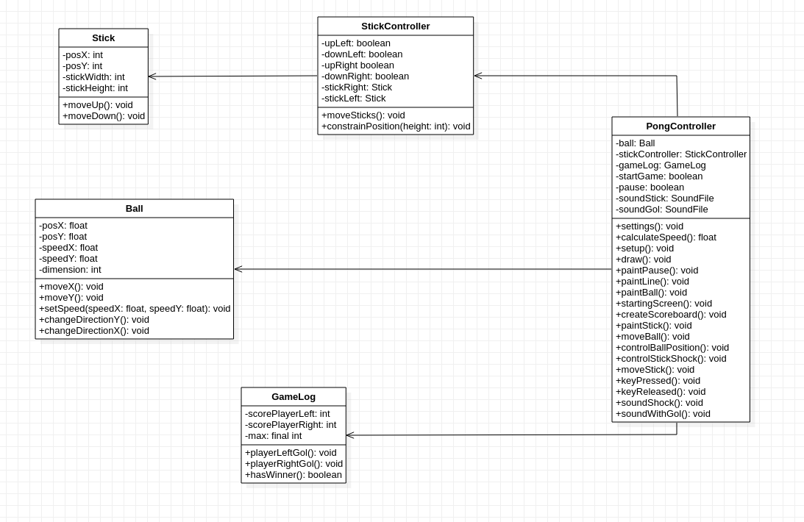

# PongGame

## Autor
Miguel Ángel Medina Ramírez <br>
Correo: miguel.medina108@alu.ulpgc.es

## Indice
1. [Introducción](#introducción)
2. [Demostración](#demostración)
3. [Dependencias](#dependencias)
4. [Implementación](#implementación)
5. [Eventos](#eventos)<br>
 5.1. [Choques](#choques)<br>
 5.2. [Teclado](#teclado)<br>
 5.3. [Sonido](#sonido)<br>
6. [Bibliografía](#bibliografía)

## Introducción
Para esta práctica se ha desarrollado mediante processing el videojuego del pong, que fundamentalmente consiste en dos palas o raquetas que interactúan con una bola que se mueve en todo el escenario. El objetivo del juego es intentar marcar gol en la zona del jugador contrario y el que consiga más puntos gana. Tanto interfaz como los objetivos y fundamentos del juego son los del pong clásico, no se a variado estos conceptos de su homólogo original, gana quien llege antes a los 10 puntos.Es más para ser la interfaz más amena se ha implementado un menú con información útil para el usuario y varios eventos clásicos en un videojuego que son la posibilidad de pausar la ejecución y reanudarla, y la posibilidad de volver al menú borrando la partida.

## Demostración
<p align="center">
  
</p>
<p align="center">
  Figura 1: Gif de muestra
</p>

## Dependencias
Para poder ejecutar y probar la práctica solamente se necesita el editor de processing y las siguientes dependencias:
- Librería **sound** para poder reproducir sonidos.Su instalación se encuentra en la documentación de la práctica.
- Librería **GifAnimation** para poder reproducir y guardar gifs. Como esta librería no forma parte necesaria para la correcta implementación de la práctica en el código toda la lógica relacionada con ella se encuentra comentada, además de que afecta al rendimiento de la aplicación.En este [enlace](http://extrapixel.github.io/gif-animation/) se encuentra la forma de instalarla.

## Implementación
Se ha modelado el diseño del juego siguiendo el patrón arquitectónico **MVC**, con la siguiente relación de clases:
<p align="center">
  
</p>
<p align="center">
  Figura 2: Diagrama UML
</p>
<br>
Donde la distribución de clase sería la siguiente:

<dl>
  <dt>Vistas</dt>
    <dd>Ball:implementa la lógica necesaria para el movimiento de la bola.</dd>
    <dd>Stick:implementa la lógica necesaria para la creación de los palos o palas y su movimiento.</dd>
  <dt>Modelo</dt>
    <dd>GameLog:el registros de goles de cada jugador.</dd>
  <dt>Controladores</dt>
    <dd>StickController: para gestionar el movimiento de las palas y la lógica del choque de la bola en ellas.</dd>
    <dd>PongController: para gestionar los inputs del usuario y toda la lógica relacionada con el juego mediante las clases   anteriores o sus propios métodos</dd>
</dl>

Los **métodos y figuras** propias de processing que se han usado en el desarrollo son los siguentes: line, stroke, noStroke, ellipse, text, textSize, rect, thread, background y size.

Gracias a que se han usado objetos se ha podido implementar un menú y el evento de pausa de manera relativamente sencilla, para ello se han usado dos variables globales booleanas que controlan el estado de estos objetos. La variable **startGame** reinicia y crea los objetos mediante el método setup y **pause** se encargará de parar la modificación de todos los datos.Ambas variables se cambian mediante eventos de teclado.

## Eventos
A la hora de abordar el pong existe una serie de eventos o sucesos que se deben tratar, que son: el choque de la bola con las palas,el control de los eventos de teclado y los sonidos.

### Choques
Para controlar el choque se la bola necesita estar en movimiento, y su posición tiene que estar cerca bajo un margen de error de alguno de los palos, de ese modo saltara el evento y cambiará de dirección. Gracias a los dos controladores es posible implementar este comportamiento mediante una serie de condicionales.
```java
public void controlStickShock(){
    Stick stickRight = stickController.getStickRight();
    Stick stickLeft = stickController.getStickLeft();
    if (ball.getSpeedX() > 0
            && stickRight.getPosY() <= ball.getPosY() + ball.getDimension()/2
            && ball.getPosY() - ball.getDimension()/2 <= stickRight.getPosY() + stickRight.getStickHeight()
            && stickRight.getPosX() <= ball.getPosX() + ball.getDimension()/2
            && ball.getPosX() - ball.getDimension()/2 <= stickRight.getPosX() + stickRight.getStickWidth() ){
        ball.changeDirectionX();
        thread("soundShock");
    } else if (ball.getSpeedX() < 0
            && stickLeft.getPosY() <= ball.getPosY() + ball.getDimension()/2
            && ball.getPosY() - ball.getDimension()/2 <= stickLeft.getPosY() + stickLeft.getStickHeight()
            && stickLeft.getPosX() <= ball.getPosX() + ball.getDimension()/2
            && ball.getPosX() - ball.getDimension()/2 <= stickLeft.getPosX() + stickLeft.getStickWidth() ){
        ball.changeDirectionX();
        thread("soundShock");
    }
}
```


### Teclado
Los eventos de teclado se controlan gracias a método **keyPressed** que controla cuando se pulsa una tecla y el método **keyReleased** que controla cuando se deja de pulsar. Se han selecida una serie de teclas para que sirvan de comunicador de las intenciones del usuario a la aplicación.

<table style="width:100%">
  <tr>
    <th>Tecla</th>
    <th>Uso</th>
  </tr>
  <tr>
    <td>w</td>
    <td>mover hacia arriba el stick izquierdo</td>
  </tr>
  <tr>
    <td>s</td>
    <td>mover hacia abajo el stick izquierdo</td>
  </tr>
  <tr>
    <td>flecha UP</td>
    <td>mover hacia arriba el stick derecho</td>
  </tr>
  <tr>
    <td>flecha DOWN</td>
    <td>mover hacia abajo el stick derecho</td>
  </tr>
  <tr>
    <td>f</td>
    <td>iniciar juego</td>
  </tr>
  <tr>
    <td>e</td>
    <td>acabar juego</td>
  </tr>
  <tr>
    <td>p</td>
    <td>parar juego</td>
  </tr>
</table>

Mediante estos métodos se ha podido implementar la lógica de control necesaria.

```java
public void keyPressed() {
    if (key == 'w' || key == 'W') {
        stickController.setUpLeft(true);
    }
    if (key == 's' || key == 'S') {
        stickController.setDownLeft(true);
    }
    if (key == 'f' || key == 'F'){
        startGame = true;
    }
    if (startGame && (key == 'e' || key == 'E')){
        startGame = false;
        pause = false;
        win = false; 
        setup();
    }
    if (startGame && !win && (key == 'p' || key == 'P')){
        pause = !pause;
    }
    if (keyCode == UP) {
        stickController.setUpRight(true);
    }
    if (keyCode == DOWN) {
        stickController.setDownRight(true);
    }
}

public void keyReleased() {
    if (key == 'w' || key == 'W') {
        stickController.setUpLeft(false);
    }
    if (key == 's' || key == 'S') {
        stickController.setDownLeft(false);
    }
    if (keyCode == UP) {
        stickController.setUpRight(false);
    }
    if (keyCode == DOWN) {
        stickController.setDownRight(false);
    }
}
```

### Sonido
Para poder implementar sonido se ha hecho uso de de la librería **sound** y de los ejemplos de la guión de prácticas, además del método *thread* para ejecutar el sonido en otro hilo de ejecución y así evitar problemas de audio.

```java
soundStick = new SoundFile(this, "Alesis-Sanctuary-QCard-Crotales-C6.wav");
soundGol = new SoundFile(this, "Alesis-Sanctuary-QCard-Loose-Bell-C5.wav");

public void soundShock(){
  soundStick.play(); 
}

public void soundWithGol(){
  soundGol.play();
}
```

## Bibliografía
* [Guion de prácticas](https://cv-aep.ulpgc.es/cv/ulpgctp20/pluginfile.php/126724/mod_resource/content/22/CIU_Pr_cticas.pdf)
* [processing.org](https://processing.org/)
