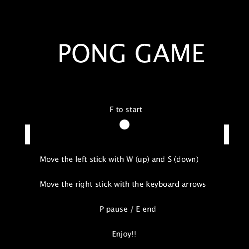

# PongGame

## Autor
Miguel Ángel Medina Ramírez  
Correo: miguel.medina108@alu.ulpgc.es

## Indice
1. [Introducción](#introducción)
2. [Demostración](#demostración)
3. [Dependencias](#dependencias)
4. [Implementación](#implementación)
5. [Bibliografía](#bibliografía)

## Introducción
Para esta práctica se ha desarrollado mediante processing el videojuego del pong, que fundamentalmente consiste en dos palas o raquetas que interactúan con una bola que se mueve en todo el escenario. El objetivo del juego es intentar marcar gol en la zona del jugador contrario y el que consiga más puntos gana. Tanto interfaz como los objetivos y fundamentos del juego son los del pong clásico, no se a variado estos conceptos de su homólogo original.

## Demostración

  

  Figura 1: Gif de muestra

## Dependencias
Para poder ejecutar y probar la práctica solamente se necesita el editor de processing y las siguientes dependencias:
- Librería **sound** para poder reproducir sonidos.Su instalación se encuentra en la documentación de la práctica.
- Librería **GifAnimation** para poder reproducir y guardar gifs. Como esta librería no forma parte necesaria para la correcta implementación de la práctica en el código toda la lógica relacionada con ella se encuentra comentada, además de que afecta al rendimiento de la aplicación.En el este [enlace](http://extrapixel.github.io/gif-animation/) se encuentra la forma de instalarla.

## Implementación
Se ha modela el diseño del juego siguendo el patrón arquitectonico MVC, con la siguente relación de clases:
**FOTO**

## Bibliografía
